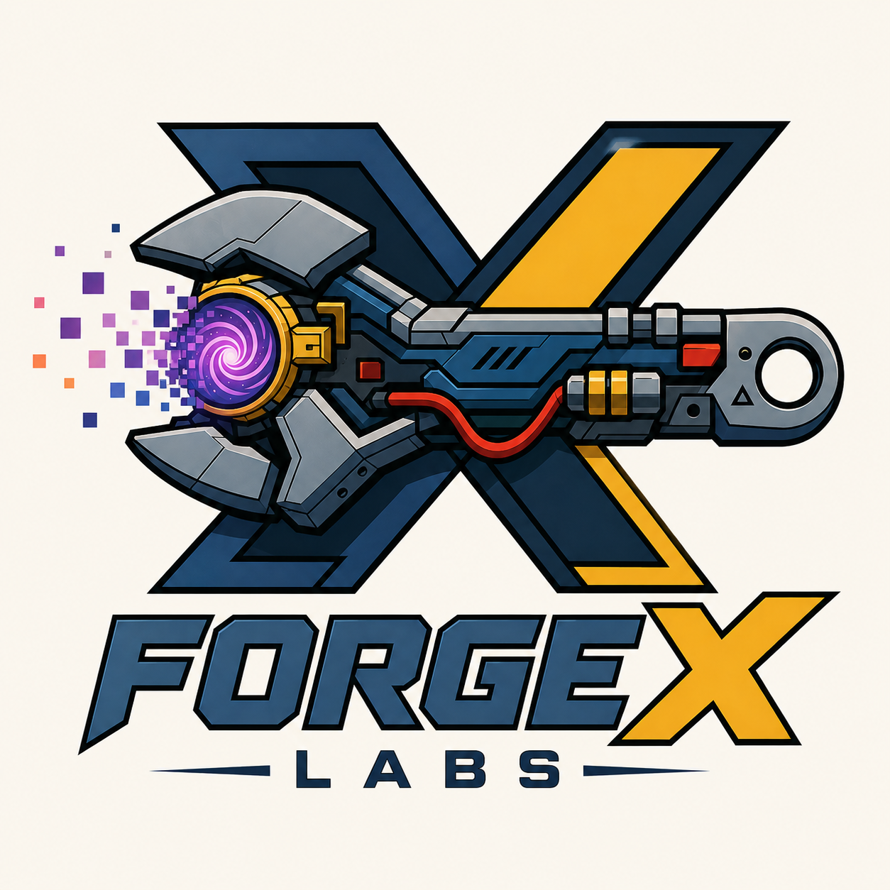
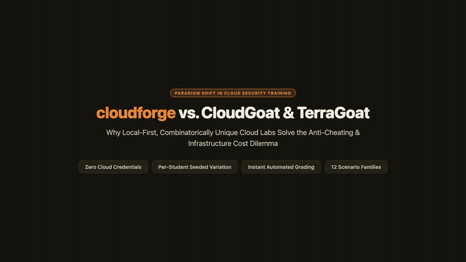

<p align="center">
  
</p>

<h1 align="center">Forge X Labs: <code>cloudforge</code></h1>

<p align="center">
  Generate a unique, validated, <strong>never-applied</strong> AWS misconfig lab
  per student. No cloud account required.
</p>

<p align="center">
  <a href="LICENSE"></a>
  
  
  
</p>

<p align="center">
  
  <br>
  <em><a href="docs/demo/cloudforge-vs-cloudgoat.mp4">Watch the MP4 demo</a></em>
</p>

---

## Job

A trainer, SOC lead, or detection-eng onboarding owner needs analysts to
practice finding a **cloud-risk path**, and cannot hand everyone a sandbox
AWS account.

`cloudforge` generates a labeled estate (risk graph + Terraform + ground
truth), hides the answer key from the student, and auto-grades a guessed
path. This is a **tabletop / static-analysis lab**, not a deploy-to-AWS
range.

## vs CloudGoat / TerraGoat

| | CloudGoat | TerraGoat | cloudforge |
|---|---|---|---|
| Student gets | A live AWS account | A static `.tf` tree | A generated estate: brief + graph view + never-applied Terraform |
| AWS account | Required | No | **No** |
| Same lab for everyone | Yes | Yes | No. `--seed` and composer decoys |
| Auto-grade the path | No | No | `cloudforge grade` |
| You learn | Console muscle memory | Whether a scanner flags a resource | Attack **paths** and labeled false positives |

We lose on live console practice and catalog depth. We win on no account,
per-student copies, and a machine-checkable key.

## Install

Python **3.12+**. Contributors use Poetry; users can install the package:

```bash
pip install -e .
cloudforge version
```

Or with Poetry:

```bash
poetry env use 3.12
poetry install
PYTHONPATH=. poetry run python -m app.cli version
```

If `.venv/bin/cloudforge` has a stale shebang, use `python -m app.cli`.

Optional on `PATH` for `validate`: `terraform`, `checkov`, `opa`. Missing
tools are skipped (WARN), not a hard fail.

## 15 minutes

Generate, check, and read one lab:

```bash
cloudforge generate examples/ci_cd_iam_chain.yaml --out out/scenario_001 --engine composer --seed 17
cloudforge validate out/scenario_001
cloudforge report   out/scenario_001
```

Open `out/scenario_001/report.md`. The critical path is
`github-actions-oidc -> DeployRole -> RuntimeRole -> customer-exports`. Checkov
typically catches the resource-level findings and **misses the PassRole
chain**. That miss is the teaching point.

### Trainer loop (`lab` / `grade` / `lab-cohort` / `grade-cohort`)

```bash
# Student pack (no answer key) + instructor pack (grade key)
cloudforge lab examples/ci_cd_iam_chain.yaml --seed 17 --out out/alice
# student/    brief.md, estate.html, estate.json, terraform/
# instructor/ report.md, expected_findings.json, grade_key.json

cloudforge grade out/alice --submission alice_guess.yaml

# Unique labs for a class
cloudforge lab-cohort examples/ci_cd_iam_chain.yaml --students names.txt --out out/cohort
cloudforge grade-cohort out/cohort --submissions out/subs
```

The student pack strips `expected_findings.json`, ground-truth attack paths,
and risk annotations (`security.risk` / `criticality`).

### Interactive workbench (`estate.html` and `cloudforge challenge`)

```bash
cloudforge challenge examples/ci_cd_iam_chain.yaml --out challenge.html --seed 17
```

The workbench is a single HTML file with no CDN:

- Five-tier layout: Perimeter, Compute, Storage, Services, Identity
- Mission briefing on the board
- Click nodes to draft an attack path
- Finding checklist
- YAML export for `cloudforge grade`
- Client-side scoring against the same math as `grade`

## Scenario families

| `scenario_type` | Teaching point | Example |
|---|---|---|
| `ci_cd_iam_chain` | CI OIDC identity -> PassRole -> sensitive data | `examples/ci_cd_iam_chain.yaml` |
| `public_data_exposure` | Public-read S3 bucket with PII and decoys | `examples/public_data_exposure.yaml` |
| `cross_account_trust` | External account trusted into sensitive data | `examples/cross_account_trust.yaml` |
| `kms_key_overbroad` | Wildcard `kms:Decrypt` on a key policy | `examples/kms_key_overbroad.yaml` |
| `public_ebs_snapshot` | Unencrypted snapshot shared with `all` | `examples/public_ebs_snapshot.yaml` |
| `iam_privesc_policy_version` | `iam:CreatePolicyVersion` to admin | `examples/iam_privesc_policy_version.yaml` |
| `ec2_imds_credential_exfil` | SSRF / IMDSv1 hop to instance role creds | `examples/ec2_imds_credential_exfil.yaml` |
| `lambda_public_function_url` | Unauthenticated Function URL (`NONE`) | `examples/lambda_public_function_url.yaml` |
| `secretsmanager_policy_overbroad` | Wildcard `secretsmanager:GetSecretValue` | `examples/secretsmanager_policy_overbroad.yaml` |
| `public_rds_instance` | Public RDS with `0.0.0.0/0` ingress | `examples/public_rds_instance.yaml` |
| `ecr_repository_public_read` | Public registry leaking deploy tokens | `examples/ecr_repository_public_read.yaml` |
| `sqs_queue_overbroad_policy` | Wildcard SQS policy | `examples/sqs_queue_overbroad_policy.yaml` |
| `k8s_pod_irsa_exfil` | Pod IRSA token -> IAM role -> sensitive S3 | `examples/k8s_pod_irsa_exfil.yaml` |
| `azure_imds_keyvault_harvest` | App Service IMDS -> Key Vault | `examples/azure_imds_keyvault_harvest.yaml` |
| `gcp_workload_identity_federation` | Workload Identity Pool -> GCS | `examples/gcp_workload_identity_federation.yaml` |

Dummy account `000000000000`. Never applied.

The last three families are **graph-only**. They generate a risk graph, workbench,
and grade key. Terraform is still AWS-only: Azure, GCP, and Kubernetes nodes
do not emit `.tf` resources yet. Use `--engine composer` (the `lab` default).

## Safety

- **Never** `terraform apply`. No AWS credentials. `deployable: true` is rejected.
- No real secrets. No offensive or operational content.
- Destructive IAM (`iam:Delete*`, `s3:DeleteBucket`, `ec2:TerminateInstances`,
  `kms:ScheduleKeyDeletion`, `organizations:*`) is a validation FAIL.
- Broad read/list grants are allowed only when documented as expected findings.

See [SECURITY.md](SECURITY.md) and [Safety and Scope](docs/wiki/Safety-and-Scope.md).

## `generate` / `validate` / `report`

```
out/scenario_001/
├── scenario.yaml              # intent
├── graph.json                 # SOURCE OF TRUTH
├── terraform/                 # compiled artifact, never applied
├── expected_findings.json
├── ground_truth_paths.json
└── report.md
```

`validate` is fail-soft: missing checkov/opa/terraform becomes WARN. A real schema
or risk-engine failure is FAIL and exit 1.

## Learning corpus

`cloudforge learn` is a data pipeline (fetch, ingest, validate, export),
not a training loop. Allow-list only (`data/source_registry.yaml`). It does
not train a model. See [Learning Corpus](docs/wiki/Learning-Corpus.md).

## Development

See [CONTRIBUTING.md](CONTRIBUTING.md). Product code lives in `app/cloudforge/`.

```bash
ruff check --fix && ruff format
mypy --strict app/
PYTHONPATH=. .venv/bin/pytest tests/cloudforge tests/security -q --no-cov
```

## Docs

[`docs/wiki/`](docs/wiki/) covers architecture, the graph model, validation,
scenario families, [labs](docs/wiki/Labs.md), and safety.
